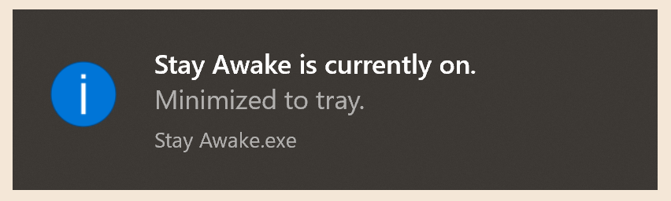

# <br />
<div align="center">
  <a href="https://github.com/trevtravtrev/StayAwake">
    
  </a>
  <p align="center">
    A minimalist app that prevents your computer from going to sleep.
    <br/>
  </p>
  <p align="center">
  <a href="https://github.com/trevtravtrev/StayAwake">
    
  </a>
  </p>
  <p align="center">
  <a href="https://github.com/trevtravtrev/StayAwake">
    
  </a>
  </p>
  <p align="center">
  <a href="https://github.com/trevtravtrev/StayAwake">
    
  </a>
  </p>
</div>

<details open>
  <summary>Table of Contents</summary>
  <ol>
    <li><a href="#prerequisites">Prerequisites</a></li>
    <li><a href="#clone-the-repository">Clone the Repository</a></li>
    <li><a href="#run-the-code">Run the Code</a></li>
    <li><a href="#additional-tools">Additional Tools</a></li>
  </ol>
</details>


# Prerequisites
- [Python](https://www.python.org/downloads/) (latest version)  
  - If using windows, in the python installer make sure to select the "Add Python to PATH" option  
- [Pycharm](https://www.jetbrains.com/pycharm/download/#section=windows) (optional)


# Clone the Repository
## Option 1: via Command Line Interface
- Install [GitHub CLI](https://cli.github.com/) (if not already installed)
  ```
  git clone https://github.com/trevtravtrev/StayAwake
  ```
## Option 2: via GitHub Desktop
1. Install [GitHub Desktop](https://desktop.github.com/) (if not already installed)  
2. Follow instructions [here](https://docs.github.com/en/desktop/contributing-and-collaborating-using-github-desktop/adding-and-cloning-repositories/cloning-a-repository-from-github-to-github-desktop) to clone
# Run the Code
## Option 1: Poetry (Recommended for StayAwake)
1. Install Poetry (if not already installed)
```
pip install poetry
```
2. Install StayAwake dependencies
```
cd StayAwake
poetry install
```
3. Run StayAwake
```
poetry run python main.py
```
## Option 2: requirements.txt
1. Create the virtual environment:
```
cd StayAwake
python -m venv venv
```
2. Activate the virtual environment:
- For Windows:
```
venv\Scripts\activate
```
- For macOS/Linux:
```
source venv/bin/activate
```
Once activated, you will notice that the prompt in your terminal or command prompt changes to indicate that you are now working within the virtual environment.  
3. Install StayAwake dependencies
```
pip install -r requirements.txt
```
4. Run StayAwake
```
python main.py
```

# Additional Tools
All StayAwake code was formatted, linted, and secured with the following tools:
- [black](https://black.readthedocs.io/en/stable/)
- [flake8](https://flake8.pycqa.org/en/latest/)
- [radon](https://radon.readthedocs.io/en/latest/)
- [bandit](https://bandit.readthedocs.io/en/latest/)
- [isort](https://pycqa.github.io/isort/)
- [mypy](https://mypy.readthedocs.io/en/stable/)

