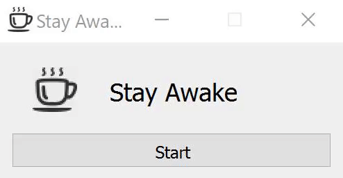
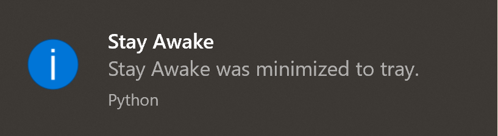

# StayAwake  
Stay Awake is a simple app that keeps your computer from going to sleep.
  
  
  
  
  
**Features:**  
  1) Lightweight  
  2) Simple one-button GUI  
  3) Minimize to tray  
  4) Runs in background  
  
**Specs:**  
  1) Python 3.8  
  2) Dependencies: PyQt5, PyAutoGUI  
  3) Compatibility: Windows, MacOS, Linux (only tested on Windows)  

**Installation:**  
  1) Clone repository  
  2) Install dependencies using pip and requirements.txt file  
  ```
  pip install -r requirements.txt
  ```
  3) Run and enjoy being AFK!!  
  
**How to make an executable:**  
  1) ```pip install pyinstaller```  
  2) ``` pyinstaller --onefile main.py --icon=StayAwake.ico --windowed --noconsole --name="Stay Awake"```  
  
**Download and run instantly without any code:**  
https://github.com/trevtravtrev/StayAwake/releases  
